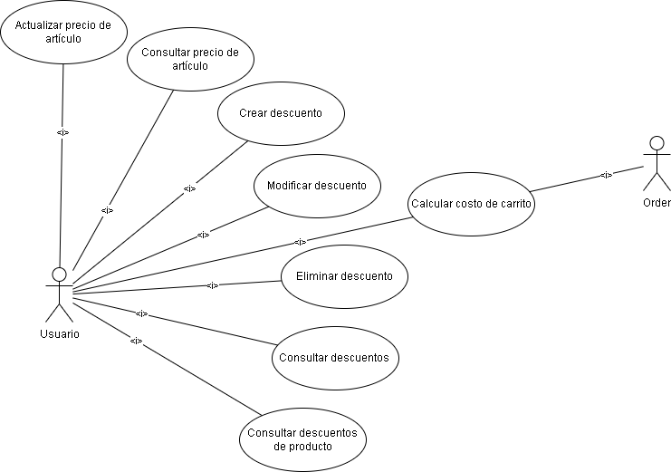
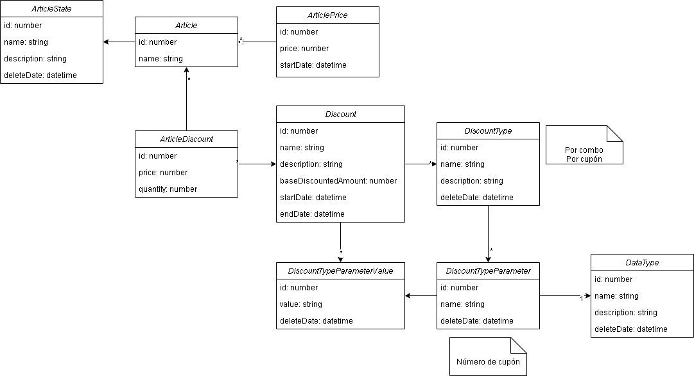

# Microservicio de precios

**Autora:** Micaela Jimena Estrella Morales
**Legajo** 47660

## Introducción

El microservicio de precios, como su nombre lo indica, permite gestionar los precios de los artículos y crear descuentos. Si bien la infraestructura admite distintos tipos de descuentos, la versión actual contará exclusivamente con descuentos por combos, por cupones y mezclas entre ambos.


## Casos de uso



### CU1. Actualizar precio de artículo

**Actor:** Usuario

**Precondición:**
* Usuario logueado

**Camino normal:**
1. Validar que se incluyó en el cuerpo de la solicitud un `price` numérico mayor a cero.
2. Validar que se incluyó en el cuerpo de la solicitud un `articleId` numérico mayor o igual a cero.
3. Si se ingresó `startDate` 
    - Validar que fecha_actual <= `startDate` 
4. Validar la existencia del artículo consultando el microservicio catálogo.
5. Crear instancia de `ArticlePrice` asociada a `Article` con:
    - `price` igual al incluido en el body.
    - `startDate` igual a la ingresada o en su defecto la actual.
5. Actualizar `Article` con `state` = `TAXED` (sin importar cuál haya sido su estado anterior).
6. Emitir evento `price_updated`

**Caminos alternativos:**
* Si el usuario no se encuentra logueado
    - Retornar mensaje de error
* Si `price` o `articleId` inválidos
    - Retornar mensaje de error
* Si error en validación de fechas
    - Retornar mensaje de error
* Si artículo inexistente
    - Buscar artículo en la base de datos. Si existe actualizarlo con `state` = `DELETED`
    - Retornar mensaje de error

**Interfaz REST**  
`POST /prices/update`

*Headers*  
Authorization: Bearer token

*Body*
```json
{
  "articleId": "123456",
  "price": "1000",
  "startDate": "2024-11-02 16:00:00.000",
}
```

*Response*

`201 CREATED` si éxito  

`400 BAD REQUEST` 
  - si no se incluyó `articleId` o price
  - si se envió algún parámetro de tipo inválido
  - si startDate < fechaActual

`403 FORBIDDEN` si el usuario no se encuentra logueado

`404 NOT FOUND` si no se encontró el artículo o fue eliminado

**Interfaz asincrónica (Rabbit)**

`PUT rabbit/price_updated`

*Body*
```json
{
  "articleId": "123456",
  "price": "1000",
  "startDate": "2024-11-02 16:00:00.000",
}
```

### CU2. Consultar precio de artículo

**Actor:** Usuario

**Precondición:**
* Usuario logueado

**Camino normal:**
1. Validar que `articleId` es un número mayor o igual a cero
2. Buscar `Article` en base de datos local con `articleId` igual al ingresado.
3. Verificar que el `state` del artículo es `TAXED`
3. Buscar `ArticlePrice` asociado al `Article` con mayor `startDate`.

**Caminos alternativos:**
* si el usuario no se encuentra logueado
    - Retornar mensaje de error
* Si no se incluyó un `articleId` válido
    - Retornar mensaje de error
* Si no se encontró el artículo o `state` != `TAXED`
    - Retornar mensaje de error
* Si no se encontró el `ArticlePrice`
    - cambiar `state` a `UNTAXED`
    - Retornar mensaje de error

**Interfaz REST**  
`GET /prices/:articleId`

*Headers*  
Authorization: Bearer token

*Response*

`200 SUCCESS` si se logró recuperar el precio 
```json
{
  "articleId": "123456",
  "price": "1000",
}
```

`400 BAD REQUEST` 
  - si no se incluyó `articleId` o es de tipo inválido
  - si `state` != `TAXED`
  - Si no se encontró el `ArticlePrice`

`403 FORBIDDEN` si el usuario no se encuentra logueado

`404 NOT FOUND` si no se encontró el artículo o fue eliminado


### CU3. Crear descuento

**Actor:** Usuario

**Precondición:**
* Usuario logueado

**Camino normal:**
1. Validar que se incluyó un parámetro `name` de longitud mayor a 0.
2. Si se incluyó un arreglo `articles` de longitud mayor a 1, validar que cada artículo tiene un `id` y un `quantity` numéricos y mayores a cero.
3. Validar que se incluyó `discountTypeId` numérico mayor a cero.
4. Si se incluyó un `startDate` en los parámetros:
    - Validar que fecha_actual <= `startDate`
5. Si se incluyó un `endDate` en los parámetros:
    - Validar que `startDate` < `endDate`
6. Validar la existencia del artículo consultando el microservicio catálogo.
7. Validar existencia de un `DiscountType` con `id`=`discountTypeId`. Al obtenerlo se recuperan los `DiscountTypeParameter` asociados.
8. Validar que por cada `DiscountTypeParameter` se incluyó un `parameterValue` con `value` de tipo válido y `parameterId` numérico mayor a cero.
9. Crear instancia `Discount` con `name` y `description` iguales a los ingresados y `discountType` igual al recuperado y con:
    - `startDate` igual a la ingresada o la actual
    - `endDate` igual a la ingresada o `NULL`
10. Crear instancias `ArticleDiscount` por cada uno de los artículos especificados.
11. Crear instancias `DiscountTypeParameterValue` por cada uno de los parámetros indicados.

**Caminos alternativos:**
* si el usuario no se encuentra logueado
    - Retornar mensaje de error
* Si `name` inválido o de longitud igual a 0.
    - Retornar mensaje de error
* Si no se incluyó `articles` o es un arreglo vacío o alguno de sus elementos no tiene `id` y `quantity` válidos o `article_exist` retornó `False`.
    - Retornar mensaje de error
* Si no se incluyó `discountType` o no se encontró un `DiscountType` asociado.
    - Retornar mensaje de error
* error en validación de fechas
    - Retornar mensaje de error

**Interfaz REST**  
`POST /prices/discounts/create`

*Headers*  
Authorization: Bearer token

*Body*
```json
{
  "name": "Navidad con cupón",
  "description": "Descuento por 2 pan dulces, una coca y un fernet.",
  "articles": [
    {
      "id": "123456",
      "quantity": "123456",
    }
  ],
  "discountTypeId": "123456",
  "startDate": "2024-11-02 16:00:00.000",
  "endDate": "2024-11-02 16:00:00.000",
  "parameterValues": [
    {
      "parameterId": "123456",
      "value": "123456",
    }
  ],
}
```

*Response*

`201 CREATED` si éxito  

`400 BAD REQUEST` 
  - si no se incluyó `id` o `price` para algún artículo.
  - si no se incluyó algún parámetro obligarorio o se envió un valor de tipo inválido
  - si startDate < fechaActual

`403 FORBIDDEN` si el usuario no se encuentra logueado

`404 NOT FOUND`
  - si no se encontró un `Article` de entre los de la lista o fue eliminado (state = `DELETED`)
  - si no se encontró un `Discount` cuyo `id` sea el ingresado y su `endDate` posterior a la fecha actual

### CU4. Modificar descuento

**Actor:** Usuario

**Precondición:**
* Usuario logueado

**Camino normal:**
1. Validar que existe un `Discount` con `id` igual al del body y `endDate` mayor a la actual.
2. Validar que se incluyó un parámetro `name` de longitud mayor a 0.
3. Validar que se incluyó un arreglo `articles` de longitud mayor a 1 y que cada artículos tiene un `id` entero mayor o igual a cero y un `quantity` numérico mayor a cero.
4. Validar que se incluyó `discountTypeId` numérico mayor o igual a cero.
5. Si se incluyó un `startDate` en los parámetros:
    - Validar que fecha_actual <= `startDate`
6. Si se incluyó un `endDate` en los parámetros:
    - Validar que `startDate` < `endDate`
7. Validar existencia de artículos mediante comunicación con el microservicio catálogo.
8. Validar existencia de un `DiscountType` con `id`=`discountTypeId`. Al obtenerlo se recuperan los `DiscountTypeParameter` asociados.
9. Validar que por cada `DiscountTypeParameter` se incluyó un `parameterValue` con `value` de tipo válido y `parameterId` numérico mayor a cero.
10. Actualizar el `Discount anterior` con `endDate` igual a la actual.
11. Crear instancia `Discount` con `name` y `description` iguales a los ingresados y `discountType` igual al recuperado y con:
    - `startDate` igual a la ingresada o la actual
    - `endDate` igual a la ingresada o la del `Discount` anterior
12. Crear instancias `ArticleDiscount` por cada uno de los artículos especificados.
13. Crear instancias `DiscountTypeParameterValue` por cada uno de los parámetros indicados.

**Caminos alternativos:**
* Si el usuario no se encuentra logueado
    - Retornar mensaje de error
* Si el `id` no se corresponde con ningún `Discount`
    - Retornar mensaje de error
* Si `name` inválido o de longitud igual a 0.
    - Retornar mensaje de error
* Si no se incluyó `articles` o es un arreglo vacío o alguno de sus elementos no tiene `id` y `quantity` válidos o `article_exist` retornó `False`.
    - Retornar mensaje de error
* Si no se incluyó `discountType` o no se encontró un `DiscountType` asociado.
    - Retornar mensaje de error
* Error en validación de fechas
    - Retornar mensaje de error

**Interfaz REST**  
`POST /prices/discounts/update`

*Headers*  
Authorization: Bearer token

*Body*
```json
{
  "id": "123456",
  "name": "Navidad con cupón",
  "description": "Descuento por 2 pan dulces, una coca y un fernet.",
	"articles": [
    {
    	"id": "123456",
    	"quantity": "123456",
    }
  ],
  "discountTypeId": "123456",
  "startDate": "2024-11-02 16:00:00.000",
  "endDate": "2024-11-02 16:00:00.000",
  "parameterValues": [
    {
    	"parameterId": "123456",
    	"value": "123456",
    }
  ],
}
```

*Response*

`201 CREATED` si éxito  

`400 BAD REQUEST` 
  - si no se incluyó un `id` 
  - si no se incluyó `id` o `price` para algún artículo
  - si no se incluyó algún parámetro obligarorio o se envió un valor de tipo inválido
  - si `startDate` < fechaActual

`403 FORBIDDEN` si el usuario no se encuentra logueado

`404 NOT FOUND`
  - si no se encontró un `Article` de entre los de la lista o fue eliminado (state = `DELETED`)
  - si no se encontró un `Discount` cuyo `id` sea el ingresado
  - si no se encontró un `DiscountType` cuyo `id` sea `discountTypeId`

### CU5. Eliminar descuento

**Actor:** usuario

**Precondición:**
* Usuario logueado

**Camino normal:**
1. Validar que existe un `Discount` con `id` igual al del body y `endDate` mayor a la actual.
2. Actualizar el `Discount` con `endDate` igual a la fecha actual

**Caminos alternativos:**
* Si el usuario no se encuentra logueado
    - Retornar mensaje de error
* Si el `id` no se corresponde con ningún `Discount` con `endDate` mayor a la actual
    - Retornar mensaje de error

**Interfaz REST**  
`POST /prices/discounts/delete`

*Headers*  
Authorization: Bearer token

*Body*
```json
{
  "id": "123456",
}
```

*Response*

`200 OK` si éxito  

`400 BAD REQUEST` si no se incluyó un `id` 

`403 FORBIDDEN` si el usuario no se encuentra logueado

`404 NOT FOUND` si no se encontró un `Discount` cuyo `id` sea el ingresado y su `endDate` posterior a la fecha actual


### CU6. Consultar descuentos

**Actor:** Usuario

**Precondición:**
* Usuario logueado

**Camino normal:**
1. Buscar en la base de datos local todos los `Discount` para los cuales
      `startDate` <= fechaActual < `endDate`
2. Buscar `ArticleDiscount` asociados a cada `Discount` y recuperar también sus `Article` asociados.
2. Retornar un arreglo de `DiscountDTO`

**Caminos alternativos:**
* si el usuario no se encuentra logueado
    - Retornar mensaje de error
* Si no se encontraron descuentos
    - Retornar un arreglo vacío

**Interfaz REST**  
`GET /prices/discounts`

*Headers*  
Authorization: Bearer token

*Response*

`200 OK` si éxito  
```json
{
  "discounts": [
    {
      "id": "123456",
      "name": "Navidad con cupón",
      "description": "Descuento por 2 pan dulces, una coca y un fernet con cupón.",
      "articles": [
        {
          "id": "123456",
          "name": "Pan dulce",
          "quantity": "2",
        }
      ],
      "discountType": {
          "id": "123456",
          "name": "Combo con cupón",
          "description": "Descuento asociado a compras en conjunto con número de cupón",
          "parameters": [
            {
              "id": "123456",
              "name": "Código de cupón",
              "dataTypeName": "STRING",
            }
          ]
      },
      "startDate": "2024-11-02 16:00:00.000",
      "endDate": "2024-11-02 16:00:00.000",
    }
  ]
}
```

`403 FORBIDDEN` si el usuario no se encuentra logueado


### CU7. Consultar descuentos de artículos

**Actor:** Usuario

**Precondición:**
* Usuario logueado

**Camino normal:**
* Buscar `Article` en la base local con `id` igual al ingresado por parámetros
* Buscar `ArticleDiscount` asociados al artículo y cuyos sus `Discount` asociados cumplan con que `startDate` <= fechaActual < `endDate`

**Caminos alternativos:**
* Si el usuario no se encuentra logueado
    - Retornar mensaje de error
* Si no existe el artículo en la base de datos local:
    - Retornar mensaje de error
* Si no se encontró descuentos aplicables
    - retornar un arreglo vacío

**Interfaz REST**  
`GET /prices/discounts?articleId=123456`

*Headers*  
Authorization: Bearer token

*Response*

`200 OK` si éxito  
```json
{
  "discounts": [
    {
      "id": "123456",
      "name": "Navidad con cupón",
      "description": "Descuento por 2 pan dulces, una coca y un fernet con cupón.",
      "articles": [
        {
          "id": "123456",
          "name": "Pan dulce",
          "quantity": "2",
        }
      ],
      "discountType": {
          "id": "123456",
          "name": "Combo con cupón",
          "description": "Descuento asociado a compras en conjunto con número de cupón",
          "parameters": [
            {
              "id": "123456",
              "name": "Código de cupón",
              "dataTypeName": "STRING",
            }
          ]
      },
      "startDate": "2024-11-02 16:00:00.000",
      "endDate": "2024-11-02 16:00:00.000",
    }
  ]
}
```

`403 FORBIDDEN` si el usuario no se encuentra logueado

`404 NOT FOUND` si no se encontró un `Article` cuyo `id` sea el ingresado, su `endDate` posterior a la fecha actual y su `startDate` anterior a esta


### CU8. Calcular costo de carrito

**Actor:** Microservicio órdenes (antes de emitir place-order)

**Precondición:**
* Usuario logueado

**Camino normal:**
1. Validar que por cada artículo del parámetro `articles` existe un `Article` en la base de datos local cuyo `id` coincida con el del body y cuyo `state` sea `TAXED`.
2. Si se especificó uno o más `discount`, por cada uno:
    - Validar la exitencia de un `Discount` cuyo `id` sea el provisto
    - Recuperar su `DiscountType`, todos los `DiscountTypeParameter` asociados a este y todos los `DiscountTypeParameterValue` asociados al `Discount`.
    - Validar que por cada `DiscountTypeParameter` se brindó un valor de `parameterId` igual al `id` del `DiscountTypeParameter` y un `value` igual al 
    - Validar que los `value` provistos coincidan con los `value` de los `DscountTypeParameterValue`.
3. Buscar otros descuentos aplicables. Se puede aplicar más de un descuento sobre el carrito pero un solo descuento por artículo. Para esto:
    - Por cada artículo no asociado a un descuento buscar un `ArticleDiscount` asociado al `Article` y a un `Discount` para el cual `startDate` <= fechaActual < `endDate`.
    - Por cada descuento encontrado recuperar `DiscountType` y sus `DiscountTypeParameter`. Si el descuento cuenta con un `DiscountTypeParameter` ya no es aplicable.
    - Si no se encontraron `DiscountTypeParameter` asociados al `DiscountType`
        - Buscar todos los `ArticleDiscount` asociados al `Discount`
        - Validar que se encuentren entre los artículos del body, que no hayan sido asociados ya a otro descuento y que sus `quantity` sean mayores o iguales a la indicada por el `ArticleDiscount`
4. Calcular costo de carrito con descuentos aplicados

**Caminos alternativos:**
* Si no se encontró algún artículo en la base de datos local o su `state` es distinto de `TAXED`:
    - Retornar mensaje de error
* Si `quantity` inválida o menor o igual a cero
    - Retornar mensaje de error
* Si no se encontró descuentos aplicables
    - calcular costo de carrito sin descuentos
* Si se especificó un descuento y este no es aplicable
    - calcular costo de carrito sin aplicar este descuento

## Modelo de datos



**Article**
- id: `number`
- state: `ArticleState`

**ArticleState**
- id: `number`
- name: `string` (`TAXED` | `UNTAXED` | `DELETED`)
- description: `string`
- deleteDate: `datetime` | `undefined`

**ArticlePrice**
- id: `number`
- price: `number`
- startDate: `datetime`
- article: `Article`

**Discount**
- id: `number`
- name: `string`
- description: `string`
- startDate: `datetime`
- endDate: `datetime` | `undefined`
- discountType: `DiscountType`

**ArticleDiscount**
- id: `number`
- price: `number`
- quantity: `number`
- article: `Article`
- discount: `Discount`

**DiscountType**
- id: `number`
- name: `string`
- description: `string`
- endDate: `datetime` | `undefined`

**DiscountTypeParameter**
- id: `number`
- name: `string`
- deleteDate: `datetime` | `undefined`
- discountType: `DiscountType`
- type: `DataType` 

**DiscountTypeParameterValue**
- id: `number`
- value: `number`
- deleteDate: `datetime` | `undefined`
- discountTypeParameter: `DiscountTypeParameter`
- discount: `Discount`

**DataType**
- id: `number`
- name: `string` (`STRING` | `INT` | `FLOAT`)
- description: `string`
- deleteDate: `datetime` | `undefined`

